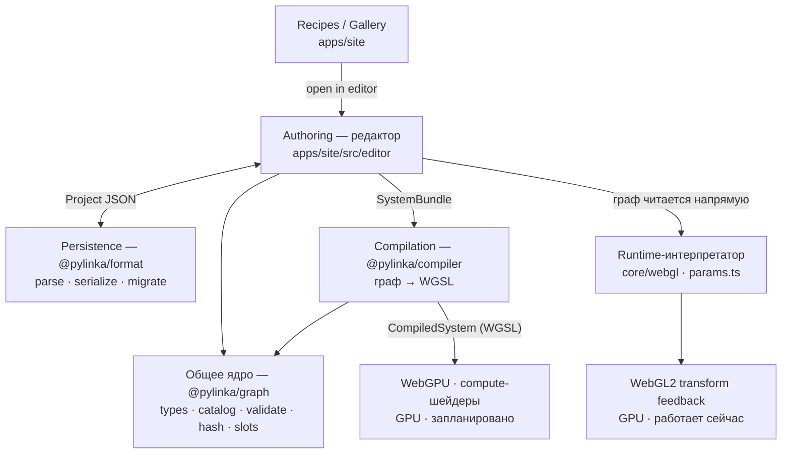
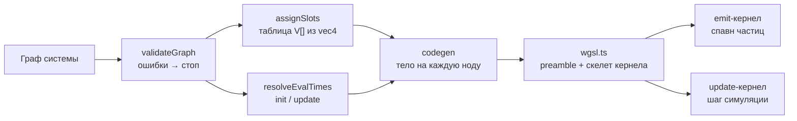
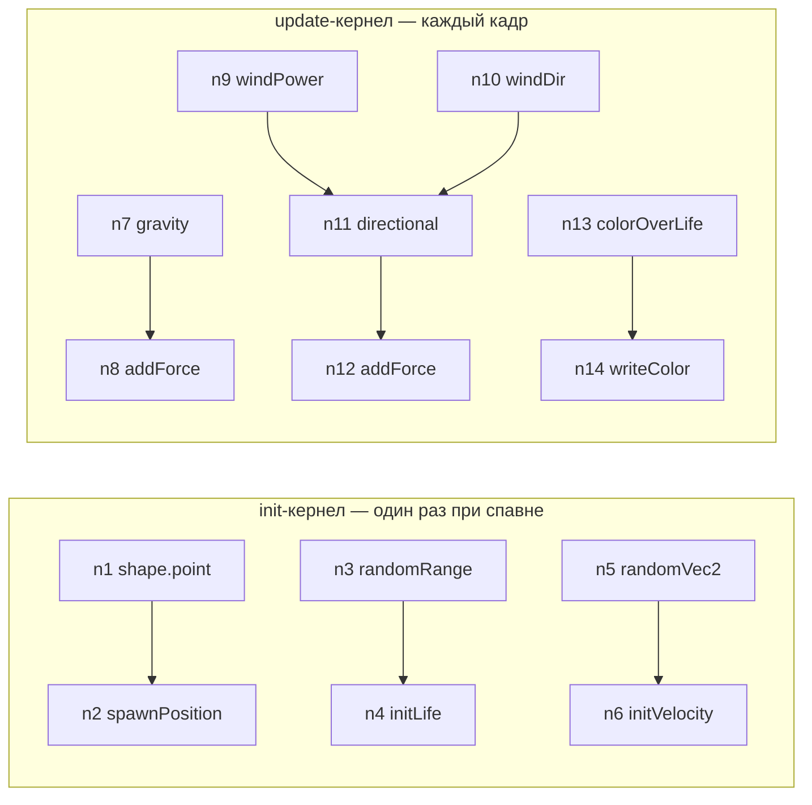
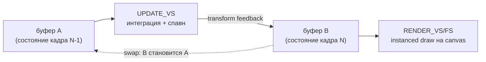
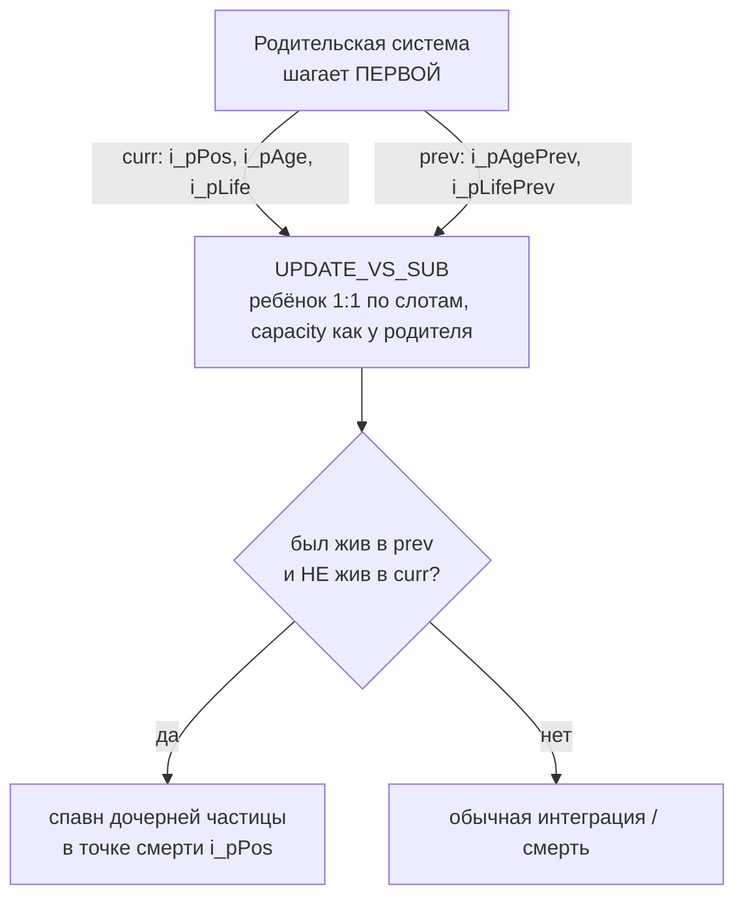
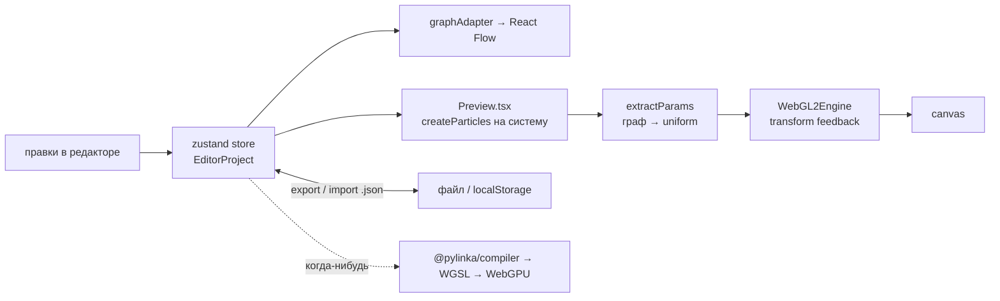

# Архитектура pylinka

Этот документ объясняет всю систему «с нуля»: как из узлового графа рождаются
GPU-шейдеры, какие есть слои, и почему их именно столько. Всё, что здесь
показано как «сгенерированный шейдер», — это настоящий вывод компилятора
(golden-фикстуры из тестов), а не псевдокод.

> Если открыть в GitHub: mermaid-блоки рендерятся в `.md`. Файл имеет расширение
> `.mdx`, поэтому для превью на GitHub можно переименовать в `.md` — JSX здесь не
> используется, разметка чистый Markdown.

---

## 1. Главная идея (прочитать первым)

Две вещи, без которых остальное не сложится:

1. **Эффект — это данные, а не код.** Любой эффект — это `PylinkaProject`:
   обычный JSON с массивом *систем*, каждая система содержит *граф* из узлов
   (`Node`) и рёбер (`Edge`). Граф — единственный источник истины.

2. **Есть ДВА независимых GPU-движка**, которые превращают один и тот же граф в
   движущиеся частицы. Оба считают и рисуют **на видеокарте** — различаются лишь
   GPU-технологией:

   - **Рабочий путь (крутится прямо сейчас)** — пакет `@pylinka/core/webgl` на
     **WebGL2 transform feedback**. Симуляция идёт на GPU: вершинный шейдер
     интегрирует состояние и пишет его обратно в GPU-буфер (это и есть transform
     feedback), рендер — один инстансированный GPU-draw. На CPU в кадре почти
     ничего — только счётчик спавна и запись uniform. Именно он работает в
     редакторе и в галерее.
   - **Запланированный путь** — пакет `@pylinka/compiler` генерирует настоящий
     WGSL и исполняет его на **WebGPU через compute-шейдеры** (более мощный,
     современный GPU-API: атомики, storage-буферы, free-list). Кодоген полностью
     готов и покрыт golden-тестами; не подключена пока только **интеграция
     WebGPU с pixi v8** (ждёт одноразового прототипа-«спайка», который проверит
     на живом железе шаринг GPU-device, вью-трансформ и хранение цвета).

> **Важно:** «за спайком» ждёт именно WebGPU-**интеграция**, а не «использование
> GPU вообще». Всё, что ты видишь в превью, уже считает и рисует GPU через
> WebGL2. Разница двух путей — WebGL2-трюк (вершинный шейдер + transform
> feedback, потому что в WebGL2 нет compute-шейдеров) против настоящих
> compute-шейдеров WebGPU.

Поэтому в репозитории есть и целый WGSL-компилятор, и WebGL-движок — это не
дублирование, а «более мощная цель на WebGPU» против «уже работающего на GPU
релиза сегодня».



Это Domain-Driven Design: каждый прямоугольник — это *ограниченный контекст*,
описанный в `REQUIREMENTS.md §4`. Ниже — каждый контекст по отдельности.

---

## 2. Общее ядро — `@pylinka/graph`

Чистый TypeScript, **ноль зависимостей, ни React, ни GPU**. От него зависят и
редактор, и компилятор; никто не форкает эти типы.

Сегменты:

| Файл | Что делает |
|---|---|
| `types.ts` | Модель: `Node`, `Edge`, `Graph`, `System`, `PylinkaProject`, `Literal` (размеченное объединение `f32`/`vec2`/`vec4`/`color`/`bool`). Это единственные авторитетные определения типов. |
| `catalog/` | Реестр *схем узлов*: порты, значения по умолчанию, `evalTime` (`init`/`update`/`both`), таблица псевдонимов для переименованных узлов. |
| `validate.ts` | Чистая валидация → типизированные диагностики. Правила приведения типов (`f32`→`vec2` размножением, `color`↔`vec4`), обязательные выходы. Ошибки блокируют компиляцию, предупреждения нет. |
| `slots.ts` | Каждому неподключённому порту и каждому «ручке»-кнобу выделяет слот `vec4` в таблице uniform. Слоты нарочно не упаковываются — превращение значения в кноб не меняет число слотов и не вызывает перекомпиляцию. |
| `hash.ts` | Структурный хеш (FNV-1a) по *форме* графа — только связность и структурные параметры, никогда значения/позиции. Одинаковый хеш ⟺ одинаковый сгенерированный код. |
| `live.ts` | Отсекает «мёртвые» подграфы (обход назад от выходных узлов). |

Ключевая мысль про `hash.ts`: это и есть точная граница «что вызывает
перекомпиляцию». Меняете число в поле — хеш тот же, код не перегенерируется
(меняется только значение в uniform). Меняете связь или структурный параметр
(например `ease`) — хеш меняется, шейдер перегенерируется.

---

## 3. Как генерируются шейдеры — `@pylinka/compiler`

Это центральная часть. Компилятор — чистая детерминированная функция
`compile(bundle, catalog, target) → CompiledSystem`, без ввода-вывода.



Разберём на реальном примере — эталонном эффекте `coin-spark-trail`.

### 3.1 Вход: граф

Граф-искры за монеткой (это точная тестовая фикстура):

```
n1  shape.point(offset=[0,0])         ── ребро pos ──▶ n2  output.spawnPosition
n3  gen.randomRange(min=0.5,max=1.2)  ── out ────────▶ n4  output.initLife
n5  gen.randomVec2(min,max)           ── out ────────▶ n6  output.initVelocity
n7  field.gravity(g=[0,300])          ── force ──────▶ n8  output.addForce
n9  param.ref(windPower) ─┐
n10 param.ref(windDir)   ─┴── strength/angle ────────▶ n11 field.directional ── force ──▶ n12 output.addForce
n13 gen.colorOverLife(from,to, ease=power2.out) ── out ▶ n14 output.writeColor
```

### 3.2 Шаг 1 — валидация

`validateGraph` проверяет типы рёбер, обязательные выходы, корректность
eval-time. Если есть ошибка — `CompileError`, дальше не идём.

### 3.3 Шаг 2 — слоты (таблица `V[]`)

`assignSlots` собирает все неподключённые значения и кнобы в таблицу
`array<vec4f, N>`. Для этого графа получается ровно **10 слотов**:

| slot | тип | откуда |
|---|---|---|
| `V[0]` | vec2 | `n1.offset` |
| `V[1]` | color | `n13.from` |
| `V[2]` | color | `n13.to` |
| `V[3]` | f32 | `n3.max` |
| `V[4]` | f32 | `n3.min` |
| `V[5]` | vec2 | `n5.max` |
| `V[6]` | vec2 | `n5.min` |
| `V[7]` | vec2 | `n7.g` |
| `V[8]` | f32 | кноб `p1` (windPower) |
| `V[9]` | f32 | кноб `p2` (windDir) |

Именно поэтому в шейдере ниже гравитация читается как `V[7].xy`, а сила ветра —
как `V[8].x`. Правка ползунка windPower меняет `V[8]` — и всё, без
перекомпиляции.

### 3.4 Шаг 3 — разделение на init и update

`resolveEvalTimes` определяет, что считается один раз при рождении частицы
(init), а что каждый кадр (update). Узлы `random*` живут в init (частица
получает случайные скорость/жизнь один раз); силы, поля и «over life» — в update.



### 3.5 Шаг 4 — кодоген + скелет

Каждый вид узла имеет маленький «эмиттер кода» (`codegen.ts`), который выдаёт
одну строку WGSL. Эти строки вставляются в фиксированный скелет из `wgsl.ts`
(структуры частицы, uniform, PRNG, тело кернела).

### 3.6 Пример 1 — сгенерированный emit-кернел (спавн)

Это дословный вывод компилятора для графа выше:

```wgsl
// ─── generated by @pylinka/compiler ─── do not edit ───
struct ParticleHot { pos: vec2f, vel: vec2f, age: f32, life: f32, }
struct ParticleRnd { color: u32, size: f32, rot: f32, }
struct ParticleMeta { seed: u32, flags: u32, }
struct Counters { freeTop: atomic<i32>, aliveCount: atomic<u32>, overflowCount: atomic<u32>, }

struct SystemUniforms {
  emitterPos: vec2f, prevEmitterPos: vec2f, emitterVel: vec2f,
  dt: f32, time: f32, frame: u32, spawnCount: u32, capacity: u32, baseSeed: u32,
}

@group(0) @binding(0) var<uniform> U: SystemUniforms;
@group(0) @binding(1) var<uniform> V: array<vec4f, 10>;          // ← 10 слотов из §3.3
@group(0) @binding(2) var<storage, read_write> hot: array<ParticleHot>;
@group(0) @binding(3) var<storage, read_write> rnd: array<ParticleRnd>;
@group(0) @binding(4) var<storage, read_write> meta: array<ParticleMeta>;
@group(0) @binding(5) var<storage, read_write> cnt: Counters;
@group(0) @binding(6) var<storage, read_write> freeList: array<u32>;

fn pcg(v: u32) -> u32 { var s = v * 747796405u + 2891336453u; let w = ((s >> ((s >> 28u) + 4u)) ^ s) * 277803737u; return (w >> 22u) ^ w; }
fn hash2(a: u32, b: u32) -> u32 { return pcg(a ^ pcg(b)); }
fn rand01(h: u32) -> f32 { return f32(h) * 2.3283064365386963e-10; }
fn srand(seed: u32, n: u32) -> f32 { return rand01(hash2(seed, n)); }

@compute @workgroup_size(64)
fn emit(@builtin(global_invocation_id) gid: vec3u) {
  let i = gid.x;
  if (i >= U.spawnCount) { return; }
  let top = atomicSub(&cnt.freeTop, 1);            // берём слот из free-list
  if (top <= 0) { atomicAdd(&cnt.freeTop, 1); atomicAdd(&cnt.overflowCount, 1u); return; }
  let slot = freeList[u32(top - 1)];
  let f = (f32(i) + 0.5) / f32(U.spawnCount);
  let spawnOrigin = mix(U.prevEmitterPos, U.emitterPos, f);   // «размазка» спавна по движению эмиттера
  let seed = hash2(U.baseSeed, hash2(slot, U.frame));

  // n1 shape.point
  let t_n1 = V[0].xy;
  // n3 gen.randomRange [stable #0]
  let t_n3 = mix(V[4].x, V[3].x, srand(seed, 0u));
  // n5 gen.randomVec2 [stable #1, #2]
  let t_n5 = mix(V[6].xy, V[5].xy, vec2f(srand(seed, 1u), srand(seed, 2u)));
  let o_spawnLocal: vec2f = t_n1; // output.spawnPosition ← n1
  let o_initLife: f32 = t_n3;
  let o_initVel: vec2f = t_n5;
  let o_texIndex: u32 = 0u;

  hot[slot].pos = spawnOrigin + o_spawnLocal;
  hot[slot].vel = o_initVel;
  hot[slot].life = max(o_initLife, 1e-4);
  hot[slot].age = U.dt * (1.0 - f);
  meta[slot].seed = seed;
  meta[slot].flags = 1u | (o_texIndex << 8u);
  rnd[slot] = ParticleRnd(0xffffffffu, 1.0, 0.0);
  atomicAdd(&cnt.aliveCount, 1u);
}
```

Обратите внимание на прямое соответствие: узел `n3 randomRange` стал строкой
`let t_n3 = mix(V[4].x, V[3].x, srand(seed, 0u));`. Компилятор не «понимает
физику» — он механически превращает граф в выражения над таблицей `V[]` и
детерминированным PRNG (`srand` от seed частицы).

### 3.7 Пример 2 — сгенерированный update-кернел (кадр)

Preamble (структуры/uniform/PRNG) тот же самый; ниже — тело. Здесь компилятор
дополнительно вставил только те ease-функции, что реально используются
(`power2.out` → `easeSel`):

```wgsl
fn easeSel(t: f32) -> f32 { let u = 1.0 - t; return 1.0 - u * u * u; }   // power2.out — вставлен по требованию
const RUNAWAY: f32 = 1e7;

@compute @workgroup_size(256)
fn update(@builtin(global_invocation_id) gid: vec3u) {
  let slot = gid.x;
  if (slot >= U.capacity) { return; }
  if ((meta[slot].flags & 1u) == 0u) { return; }   // мёртвый слот — пропуск
  var p = hot[slot];
  let seed = meta[slot].seed;
  let ageN = clamp(p.age / p.life, 0.0, 1.0);
  var force = vec2f(0.0);
  var dragK = 0.0;
  var kill = false;
  var outColor = unpack4x8unorm(rnd[slot].color);
  var outSize = rnd[slot].size;
  var outRot = rnd[slot].rot;

  // n7 field.gravity
  let t_n7 = V[7].xy;
  // n9 param.ref → windPower
  let t_n9 = V[8].x;
  // n10 param.ref → windDir
  let t_n10 = V[9].x;
  // n11 field.directional
  let t_n11 = vec2f(cos(t_n10), sin(t_n10)) * t_n9;
  // n13 gen.colorOverLife [ease=power2.out]
  let t_n13 = mix(V[1], V[2], easeSel(ageN));
  force += t_n7;       // output.addForce (n8)
  force += t_n11;      // output.addForce (n12)
  outColor = t_n13;    // output.writeColor (n14)

  p.vel += force * U.dt;
  p.vel *= exp(-dragK * U.dt);
  p.pos += p.vel * U.dt;
  p.age += U.dt;
  let runaway = any(abs(p.pos) > vec2f(RUNAWAY));
  if (p.age >= p.life || kill || runaway) {          // смерть → вернуть слот в free-list
    meta[slot].flags = meta[slot].flags & ~1u;
    let idx = atomicAdd(&cnt.freeTop, 1);
    freeList[u32(idx)] = slot;
    atomicSub(&cnt.aliveCount, 1u);
    return;
  }
  hot[slot] = p;
  rnd[slot].color = pack4x8unorm(clamp(outColor, vec4f(0.0), vec4f(1.0)));
  rnd[slot].size = outSize;
  rnd[slot].rot = outRot;
}
```

Соответствие «узел → строка» в update-кернеле:

| Узел графа | Сгенерированная строка WGSL |
|---|---|
| `n7 field.gravity` | `let t_n7 = V[7].xy;` |
| `n9 param.ref windPower` | `let t_n9 = V[8].x;` |
| `n10 param.ref windDir` | `let t_n10 = V[9].x;` |
| `n11 field.directional` | `let t_n11 = vec2f(cos(t_n10), sin(t_n10)) * t_n9;` |
| `n13 gen.colorOverLife (power2.out)` | `let t_n13 = mix(V[1], V[2], easeSel(ageN));` |
| `n8 / n12 output.addForce` | `force += t_n7;` / `force += t_n11;` |
| `n14 output.writeColor` | `outColor = t_n13;` |

### 3.8 Инварианты, которые здесь важны

- **Детерминизм.** Одинаковый вход → байт-в-байт одинаковый WGSL. Это
  зафиксировано golden-снапшотами (`packages/compiler/test/golden/*.wgsl`) —
  любое изменение кодогена сразу видно в диффе.
- **Фиксированный скелет + вставки.** Компилятор не пишет шейдер «с нуля» — он
  подставляет тела узлов в шаблон. Отсюда предсказуемость и безопасность.
- **Хеш → кэш пайплайнов.** Структурный хеш графа — ключ кэша скомпилированных
  программ. Правки значений не трогают хеш и не перекомпилируют шейдер.

---

## 4. Второй путь — WebGL2-интерпретатор (`@pylinka/core/webgl`)

Это то, что реально рисует частицы сегодня. Ключевое отличие: **здесь нет
кодогена**. Вместо генерации шейдера под каждый граф есть один *фиксированный*
шейдер и «интерпретатор», который раскладывает граф в его uniform.

### 4.1 `params.ts` — граф в фиксированные uniform

Функция `extractParams` проходит по графу системы и распознаёт частые паттерны
(форма спавна, случайные скорость/жизнь, гравитация, ветер по кнобу, drag,
цвет-по-жизни, размер-по-жизни) — и кладёт их в структуру `EngineParams`.
Нераспознанные узлы просто игнорируются (эффект всё равно запускается).

### 4.2 Фиксированный шейдер симуляции

Состояние частицы — 7 float: `pos.xy, vel.xy, age, life, seed`. Ядро
`UPDATE_VS` (GLSL ES 3.00) интегрирует и заново «рождает» мёртвые слоты в окне
курсора:

```glsl
bool alive = (i_life > 0.0) && (i_age < i_life);
float rel = mod(id - u_spawnBase + u_capacity, u_capacity);
bool inWindow = rel < u_spawnCount;

if (!alive && inWindow) {                 // спавн: слот в окне и мёртв
  float s = hash11(id * 7.77 + u_frame * 3.13 + 1.0);
  o_pos  = u_emitter + shapeOffset(s);
  o_vel  = mix(u_velMin, u_velMax, vec2(rnd(s,3.0), rnd(s,4.0)));
  o_life = mix(u_lifeMin, u_lifeMax, rnd(s,5.0));
  o_age  = 0.0; o_seed = s; return;
}
// ... иначе интеграция: vel += (gravity+wind)*dt; pos += vel*dt; age += dt;
```

Симуляция целиком на GPU через transform feedback с ping-pong буферами:



### 4.3 Атлас-последовательности (спрайты)

`RENDER_VS` умеет рисовать не только мягкий круг, но и кадр из атласа: строка =
последовательность, столбец = кадр. Случайная строка выбирается по seed частицы,
столбец бежит по возрасту. Так, например, монетки крутятся, каждая своим цветом.

### 4.4 Мульти-эмиттеры

У `ParticlesHandle` есть поле `autoClear`. Чтобы нарисовать несколько систем на
одном canvas, создаём по хэндлу на систему: первый очищает кадр, остальные
дорисовываются поверх (`blendMode` у каждого свой). Редактор так и делает —
рендерит все включённые эмиттеры на одном холсте.

### 4.5 Саб-эмиттеры (спавн при смерти)

Это самое интересное расширение движка. Дочерняя система «наследует» смерти
родителя: когда частица родителя умирает, в её точке рождается дочерняя частица.
Реализовано полностью на GPU, без чтения буфера на CPU.

Как ловится момент смерти: мёртвый слот в шейдере имеет `life == 0`, а «умер
именно сейчас» = был живой в прошлом кадре и не живой в текущем. Значит дочернему
кернелу `UPDATE_VS_SUB` нужны *текущий* и *предыдущий* буферы родителя (движок
ping-pong как раз хранит оба).



Соответствующее ядро шейдера:

```glsl
bool pPrevAlive = (i_pLifePrev > 0.0) && (i_pAgePrev < i_pLifePrev);
bool pCurrAlive = (i_pLife > 0.0)     && (i_pAge     < i_pLife);
bool justDied   = pPrevAlive && !pCurrAlive;   // ровно кадр перехода живой→мёртвый

if (justDied) {                    // родитель умер здесь → рождаем ребёнка
  o_pos  = i_pPos + shapeOffset(s);
  o_vel  = mix(u_velMin, u_velMax, ...);
  o_life = mix(u_lifeMin, u_lifeMax, rnd(s,5.0));
  o_age  = 0.0; return;
}
```

На движке это выражено так: у `WebGL2Engine` появился режим `sub`, который
собирает VAO по всем комбинациям ping-pong-состояний родителя и ребёнка, а
`createParticles` принимает опцию `subParent` (хэндл-родитель, тот же canvas).
Родитель обязан шагать раньше ребёнка — в `Preview.tsx` системы сортируются
топологически.

### 4.6 WebGL2 TF против WebGPU compute — зачем второй путь

Оба пути считают на GPU, но разными средствами. WebGL2 старше и не имеет
compute-шейдеров, поэтому симуляцию приходится делать «трюком»; WebGPU даёт
настоящие вычислительные шейдеры и на нём открываются вещи, недоступные в WebGL2.

| | WebGL2 (сейчас) | WebGPU (планируется) |
|---|---|---|
| Как считается симуляция | вершинный шейдер + transform feedback (compute-шейдеров нет) | настоящий compute-шейдер (WGSL) |
| Управление слотами | «окно курсора»: спавним частицы в скользящем диапазоне id (атомиков нет) | атомарный free-list (`atomicSub`/`atomicAdd`) — точный учёт живых/мёртвых |
| Состояние на частицу | 7 float, фиксировано (`pos, vel, age, life, seed`) | структуры `hot`/`rnd`/`meta`: больше полей (упакованный цвет `u32`, size, rot, flags, texIndex) |
| Откуда берётся шейдер | один фиксированный шейдер + `extractParams` раскладывает граф в uniform (интерпретатор) | кодоген из графа (компилятор) — под каждый граф свой WGSL |
| Гибкость графа | распознаёт частый набор паттернов, остальное игнорирует | произвольный граф узлов целиком |
| Доступность | практически везде | поддержка браузеров растёт |

Почему WebGL2 первым: он прагматичен — работает почти во всех браузерах и уже
покрывает ~90% типового слот-VFX (шлейфы, огонь, магия, монетки, мульти- и
саб-эмиттеры). WebGPU-путь догонит его для произвольных сложных графов и
максимальной мощности, когда «спайк» подтвердит интеграцию с pixi.

Практический вывод: **выбор пути не виден автору эффекта**. Граф один и тот же;
меняется лишь движок, который его исполняет. Сегодня это WebGL2, завтра рядом
встанет WebGPU — тот же проект, те же ноды.

---

## 5. Рантайм-примитивы и интеграция с pixi — `@pylinka/core`

Кроме WebGL-движка, здесь живут независимые от GPU кусочки (полностью покрыты
тестами, без аллокаций в кадре):

- `SpawnScheduler` — единственная работа на CPU в кадре: превращает настройки
  эмиттера (`flow` со скоростью и rate-over-distance, таймерный `burst`,
  одноразовый `once`) в число частиц для спавна.
- `KnobStore` — шина «живых» кнобов (промоутнутых параметров).
- `FixedStepDriver` / `clampDt` — политика шага по времени.

Плюс интеграция с pixi v8 (`render/`): плагин `Application` достаёт GPU-backend
из рендерера pixi и кладёт его в `app.pylinka`; `ParticleView` и
`PylinkaRenderPipe` вписывают частицы в сцен-граф. Сцена готова и типизирована;
вычислительный backend, который заполнит `SimBackend`, — та самая часть за
спайком.

---

## 6. Персистентность — `@pylinka/format`

`parse` / `serialize` / `migrate`. Версионирование на двух уровнях (документ и
каталог узлов): старые проекты грузятся через псевдонимы и миграции, а незнакомые
виды узлов *сохраняются*, а не выкидываются, — проект из более новой версии
деградирует мягко. Редактор сейчас пишет в `localStorage`; это тот же контекст.

---

## 7. Authoring — редактор (`apps/site/src/editor`)

Остров на React 19, смонтированный Astro.

- `store.ts` — стор на zustand: `EditorProject` (проект + редакторские
  `textures`, `systemTextures`, `subEmitters`), позиции узлов, активная система и
  два счётчика ревизий: `rev` (правки графа/значений → живой re-apply) и `texRev`
  (смена текстур/набора систем → пересоздание движка).
- Холст графа — `@xyflow/react` (React Flow). `graphAdapter.ts` проецирует
  *активную* систему в узлы/рёбра; `PylinkaNode.tsx` рисует порты и редакторы
  значений по схеме из каталога; `Palette.tsx` — библиотека узлов.
- `Systems.tsx` — вкладки эмиттеров: добавить/переименовать/заглушить/удалить и
  селектор «spawns from» для саб-эмиттеров.
- `Preview.tsx` — владеет canvas и rAF-циклом, строит по хэндлу на включённую
  систему в топологическом порядке (родители раньше детей) и на `rev` живьём
  применяет правки. `Assets.tsx` управляет библиотекой текстур.

Редактор общается только с публичным контрактом `createParticles` — он никогда
не лезет в шейдеры или внутренности движка (антикоррупционный слой).

---

## 8. Рецепты / галерея (`apps/site/src/recipes` + `tools/gen-previews`)

- `data.ts` — каждый рецепт это настоящий `PylinkaProject`, собранный двумя
  фабриками: `fx()` (одна система) и `combo()` (несколько систем + атласы на
  систему + связи саб-эмиттеров `[child, parent]`), обе поверх общего
  `buildSystem` с префиксными, глобально-уникальными id узлов.
- `capture.astro` рисует один рецепт на весь экран (все системы, с проводкой
  саб-эмиттеров); `tools/gen-previews/gen.mjs` гоняет его в headless Chromium,
  пишет webm и кодирует зацикленную карточку. В галерее показываются эти webm, а
  «open in editor» форкает рецепт в новый проект.

---

## 9. Полный поток данных (сквозной)



Сплошные стрелки — рабочий путь сегодня; пунктир к компилятору — путь, который
уже написан и ждёт подключения GPU-backend.

---

## 10. Сборка, тесты, CI

- Монорепо на pnpm workspaces; пакеты собираются `tsup` (ESM + `.d.ts`), сайт —
  Astro 5.
- Тесты `vitest`: юнит + golden-WGSL (байт-в-байт) + тесты на отсутствие
  аллокаций. CI гоняет typecheck/lint/test после `pnpm build` (dist нужен для
  межпакетных типов). Производительность меряется отдельно Playwright-бенчем и в
  CI не гейтится.

---

## Приложение — краткий словарь

- **Система (System)** — один пул частиц: `capacity`, `blendMode`, эмиттер и
  граф. Проект содержит массив систем (мульти-эмиттеры).
- **Слот `V[]`** — ячейка `vec4` в таблице uniform; сюда попадают все
  неподключённые значения и кнобы.
- **Кноб (knob)** — параметр, «поднятый» в живую крутилку; меняется без
  перекомпиляции.
- **Структурный хеш** — отпечаток формы графа; определяет, что вызывает
  перегенерацию шейдера.
- **init / update кернел** — «один раз при рождении» против «каждый кадр».
- **Transform feedback** — механизм WebGL2, позволяющий вершинному шейдеру
  писать результат обратно в буфер (симуляция на GPU без compute-шейдеров).
- **Саб-эмиттер** — дочерняя система, чьи частицы рождаются в точках смерти
  частиц родителя.
